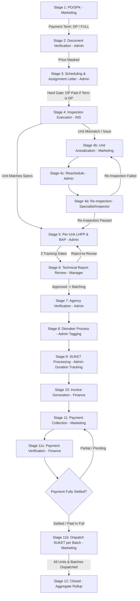

# MASTER DOCUMENTATION: DNP MONITOR V3 SYSTEM UPDATES

This document provides an exhaustive, granular reference of all architectural changes, workflow revisions, UI interactive items (buttons, inputs, modals, action triggers), and database schema / JSON attribute updates across **DNP Monitor Version 3 (v3)**.

---

## 1. Overview & Primary Objectives of V3 Updates

The transition to **Version 3 (v3)** addresses real-world operational workflows across cross-functional roles (Marketing, Admin, Field Inspection, Management, and Finance) to eliminate the limitations of the previous monolithic single-job model:

1. **Granular Unit-Level Tracking (Equipment):** Shifts from binary job-level status progression to unit-level (equipment) tracking. Problematic units no longer block passing units from advancing through the pipeline.
2. **Partial Multi-Batch SUKET Delivery:** Supports phased issuance and multi-batch dispatch of government certificates (SUKET) from Disnaker (e.g., in batches of 10–20 units).
3. **Stage 11c (Payment Verification) Repositioning & Hard Gate:** Decouples customer collection responsibilities (Marketing) from fund reconciliation (Finance), with an automated retry loopback if payments are incomplete or pending.
4. **Universal Finance Invoice Revision:** Allows Finance to correct or amend invoices at any stage ($\ge 10$) without rolling back the active workflow stage.
5. **Price Masking (Commercial Data Protection):** A hard gate enforced at both backend serializer and frontend UI layers to isolate commercial price data (`nilai`) from Admin and Field Inspection roles.
6. **Infinite Ceiling & Multi-Tier Escalation:** Jobs with stuck units are not canceled automatically. Instead, they are governed by duration-based SLA reminders (Day 7, Day 14, and recurring every 14 days).
7. **Aggregated Status Rollup & Job Splitting:** Supports splitting non-compliant units into child jobs (`parent_job_id`) while dynamically computing PO-family status (`Open`, `Partial`, `Closed`).

---

## 2. V3 End-to-End Workflow Diagram

---

## 3. Detailed Stage-by-Stage UI Elements, Buttons & Database Specifications

### 3.1 Stage 1: PO / SPK Creation & Job Information
* **Primary PIC:** Marketing / Superadmin
* **Frontend Interactive UI Elements & Buttons:**
  * **`Job Baru` Button** (Top bar): Opens Job Creation Modal (`JobCreate.jsx`).
  * **Job Creation Input Fields**:
    * `klien` (Client name text input)
    * `pesawat` (Equipment type text input)
    * `lokasi` (Interactive dropdown via `IndonesiaLocationSelect`)
    * `units` (Number of equipment units, min 1)
    * `nilai` (Contract value, masked for non-commercial roles)
    * `no_po` (PO / SPK reference text input, e.g. `PO/2026/001`)
    * `tgl_po` (PO issuance date picker)
    * `termin_pembayaran` (Dropdown: `FULL` [Pelunasan 100%] vs `DP` [Termin / Uang Muka])
    * `dp_amount` & `dp_percentage` (Conditional numerical inputs displayed when `termin_pembayaran === 'DP'`)
    * `pic_klien` & `pic_klien_phone` (Client PIC contact inputs)
    * `no_seri` (Equipment serial number, conditionally mandatory for *Listrik* and *Kebakaran* categories)
  * **Info & Edit Tab (`JobDetailSheet.jsx`)**:
    * **View Mode**: Displays `Kode Job`, `Marketing`, `Klien`, `PIC Klien` (with phone), `No. PO / SPK`, `Tanggal PO`, `Termin Pembayaran`, `Jenis Alat`, `Jumlah Unit`, `Lokasi`, and `Nilai Kontrak`.
    * **`Edit` Button**: Unlocks editable form updating PO details, PIC, client, equipment, units, and contract value.
    * **`Simpan Perubahan` Button**: Submits updates to `POST /jobs/:id` via Inertia form.
    * **`Batal` Button**: Cancels edit mode.
  * **`Hapus Job` Button** (Superadmin only): Red action button in header triggering SweetAlert2 confirmation dialog.
* **Database & JSON Schema Fields Updated:**
  * `jobs.no_po` (`VARCHAR(100)` / string)
  * `jobs.tgl_po` (`DATE` / ISO string `YYYY-MM-DD`)
  * `jobs.termin_pembayaran` (`ENUM('FULL', 'DP')` / string)
  * `jobs.dp_amount` (`DECIMAL(15,2)` / number)
  * `jobs.dp_percentage` (`DECIMAL(5,2)` / number)
  * `jobs.dp_paid` (`BOOLEAN`, default `false`)
  * `jobs.pic_klien` (`VARCHAR(150)` / string)
  * `jobs.pic_klien_phone` (`VARCHAR(50)` / string)
  * `jobs.no_seri` (`VARCHAR(100)` / string)

---

### 3.2 Stage 2: Document Verification & Document Debt Hard-Gate
* **Primary PIC:** Admin / Superadmin
* **Frontend Interactive UI Elements & Buttons:**
  * **10-Item Document Checklist (`s2_verify_data`)**:
    * Interactive radio/button group for each document type: `OK` (Green), `Tidak` (Red), `N/A` (Gray).
    * Supported documents: *Surat Permohonan*, *PO/SPK*, *Data Teknis/Spesifikasi*, *Gambar Konstruksi*, *Sertifikat Material / Surat Keterangan Material* (PAA/Elevator), *Suket Pemakaian Sebelumnya*, *Manual Book*, *Layout Ruangan*, *Single Line Diagram* (Listrik), *Form Disnaker*.
  * **`Bypass Dokumen` Button & Modal** (Manager / Superadmin only):
    * Requires `stage2_bypass_justification` text input.
    * Generates `document_debt` list storing unverified documents.
  * **Document Debt Warning Banner**: Amber alert banner displayed in `JobDetailSheet` across later stages until debt is settled.
  * **Upload Slots (`UploadSlot.jsx`)**: Supports drag-and-drop or file selection for 10 document types.
  * **`Lanjut ke Stage 3 (Jadwal) →` Button**: Advance button, disabled if required documents are incomplete and not bypassed.
  * **`Tolak / Kembalikan` Button**: Rejects job back to Stage 1 with required `returnNotes`.
* **Database & JSON Schema Fields Updated:**
  * `jobs.s2_verify_data` (`JSON` object: `{ [doc_type]: 'ok' | 'tidak' | 'na' }`)
  * `jobs.stage2_bypassed` (`BOOLEAN`, default `false`)
  * `jobs.stage2_bypass_justification` (`TEXT` / string)
  * `jobs.stage2_bypass_approved_by` (`VARCHAR(100)` / string)
  * `jobs.document_debt` (`JSON` array of strings: `['Doc Name 1', 'Doc Name 2']`)

---

### 3.3 Stage 3: Scheduling, Team & Smart Recommendation Engine
* **Primary PIC:** Admin / Superadmin
* **Frontend Interactive UI Elements & Buttons:**
  * **Multi-Day Schedule Builder**:
    * `+ Tambah Hari` Button: Appends date row to `schedule_days`.
    * `Hapus Hari` Button: Removes schedule day.
    * `date` (Date picker per day)
    * `jam_mulai` (Time input, default `08:00`)
    * `durasi_hari` (Number input)
  * **Inspector Assignment Selector (`SmartRecommendation.jsx`)**:
    * Multi-select inspector checkboxes.
    * Real-time recommendation cards displaying: `Match Score (%)`, `SKP Validity Status`, `Current Workload Count`, `Overload Warning Tag`.
  * **Master Data Tool & PJK3 Certificate Selectors**:
    * Multi-select dropdown for Testing Tools (`alat_ids`) filtered from `/api/master-data`.
    * Multi-select dropdown for PJK3 SKP Certificates (`cert_ids`).
  * **Disnaker Destination (`disnaker_tujuan`)**: Input text for target provincial Disnaker office.
  * **DP Hard-Gate Check**: If `termin_pembayaran === 'DP'` and `dp_paid === false`, advances are blocked with warning: *"Menunggu konfirmasi pelunasan DP dari Finance"*.
  * **`Simpan Jadwal` Button**: Saves schedule to backend without moving stage.
  * **`Lanjut ke Stage 4 (Pelaksanaan RU) →` Button**: Issues Assignment Letter (Surat Tugas) and advances stage.
* **Database & JSON Schema Fields Updated:**
  * `jobs.schedule_days` (`JSON` array: `[{ date: 'YYYY-MM-DD', inspector_ids: [1, 2] }]`)
  * `jobs.inspector_ids` (`JSON` array of user IDs)
  * `jobs.alat_ids` (`JSON` array of equipment IDs)
  * `jobs.cert_ids` (`JSON` array of PJK3 certificate IDs)
  * `jobs.disnaker_tujuan` (`VARCHAR(150)` / string)
  * `jobs.jam_mulai` (`VARCHAR(10)`, default `'08:00'`)
  * `jobs.durasi_hari` (`INT`, default `1`)

---

### 3.4 Stage 4, 4b, 4c, 4d: Field Inspection, Unit Split & Rework Loop
* **Primary PIC:** Field Inspector (S4, S4d) / Marketing (S4b) / Admin (S4c)
* **Frontend Interactive UI Elements & Buttons:**
  * **Unit Actualization Inputs (S4 / S4b)**:
    * `actual_units` (Number input reflecting units found on site)
    * `unit_count_notes` (Textarea explaining unit discrepancy)
  * **Mandatory Photo Upload Slots (S4)**:
    * 3 Required Slots: *Foto Nameplate*, *Foto Unit Fisik*, *Foto Pengujian/Riksa Uji*.
  * **`Pecah Job (Split Job Modal)` Button (`SplitJobModal.jsx`)**:
    * Opens modal allowing partial units to advance to Stage 5 while diverting defective units to Stage 4b.
    * Generates a linked child job (`parent_job_id`) and updates `JobFamilyDrawer.jsx`.
  * **`Lanjut ke Stage 5 (LHPP) →` Button**: Happy Path advance when 100% units comply.
  * **`Alihkan ke Stage 4b (Aktualisasi) →` Button**: Diverts job when field unit count or specs differ.
  * **Reschedule RU (S4c)**:
    * `reschedule_reason` (Dropdown: *Klien Belum Siap*, *Alat Rusak*, *Cuaca Buruk*, *Izin Masuk Tertunda*)
    * `tgl_reschedule` (Date picker)
    * `reschedule_notes` (Textarea)
    * `reschedule_count` (Auto-incremented, max 3 before escalation)
  * **Re-Inspection RU Ulang (S4d)**:
    * `ru_ulang_status` (Dropdown: `lolos` $\rightarrow$ Stage 5, `tidak_lolos` $\rightarrow$ Stage 4b)
    * `ru_ulang_notes` (Textarea)
* **Database & JSON Schema Fields Updated:**
  * `jobs.actual_units` (`INT`)
  * `jobs.unit_count_notes` (`TEXT`)
  * `jobs.parent_job_id` (`VARCHAR(50)` / null)
  * `jobs.split_from_job_id` (`VARCHAR(50)` / null)
  * `jobs.split_history` (`JSON` array of split logs)
  * `jobs.reschedule_reason` (`VARCHAR(100)`)
  * `jobs.tgl_reschedule` (`DATE`)
  * `jobs.reschedule_notes` (`TEXT`)
  * `jobs.reschedule_count` (`INT`, default `0`)
  * `jobs.ru_ulang_status` (`ENUM('lolos', 'tidak_lolos')`)
  * `jobs.ru_ulang_notes` (`TEXT`)

---

### 3.5 Stage 5: LHPP & 3-Date Milestone Drafting
* **Primary PIC:** Admin / Technical Report Writer
* **Frontend Interactive UI Elements & Buttons:**
  * **3 Milestone Date Trackers**:
    1. `tgl_teknis_diserahkan` (Date picker: Technical notes handed over by Inspector)
    2. `tgl_laporan_mulai` (Date picker: Admin begins drafting report)
    3. `tgl_laporan_selesai` (Date picker: LHPP draft completed)
  * **Lead Time Badge**: Displays auto-calculated turnaround time (`X Hari Kalender`).
  * **Upload Slots**: *Draft LHPP (PDF)* & *BAP Lapangan (PDF)*.
  * **`Simpan Milestone LHPP` Button**: Persists date checkpoints.
  * **`Lanjut ke Stage 6 (Review Laporan) →` Button**: Submits report to Manager.
* **Database & JSON Schema Fields Updated:**
  * `jobs.tgl_teknis_diserahkan` (`DATE` / ISO string)
  * `jobs.tgl_laporan_mulai` (`DATE` / ISO string)
  * `jobs.tgl_laporan_selesai` (`DATE` / ISO string)

---

### 3.6 Stage 6: Technical Report Review (Kadiv / QC / Manager)
* **Primary PIC:** Management / Manager / Kadiv QC
* **Frontend Interactive UI Elements & Buttons:**
  * **Review Decision Controls**:
    * `Approve Laik → Lanjut ke Stage 7 →` (Green action button)
    * `Kembalikan ke Stage 5 (Revisi)` (Amber action button, increments `revision_count`)
    * `Tidak Laik → Retest (Stage 4c)` (Red action button, diverts to rework chain)
  * `s5_review_notes` (Mandatory feedback textarea on revision/retest)
* **Database & JSON Schema Fields Updated:**
  * `jobs.s5_review_decision` (`ENUM('approved', 'rejected', 'tidak_laik')`)
  * `jobs.s5_review_notes` (`TEXT`)
  * `jobs.revision_count` (`INT`, default `0`, max 2)

---

### 3.7 Stage 7, 8, 9: Disnaker Process & Batch SUKET Lead Time
* **Primary PIC:** Admin / Superadmin
* **Frontend Interactive UI Elements & Buttons:**
  * **Stage 7 (Penyerahan ke Dinas)**:
    * `tgl_submit_disnaker` (Mandatory date picker)
    * `batch_no` (Batch identifier input, default `Batch 1`)
    * Upload: *Bukti Penyerahan Dokumen ke Disnaker (PDF/JPG)*
    * `Simpan Tanggal Penyerahan` Button
  * **Stage 8 (Proses Disnaker Monitoring)**:
    * `s8_progress_status` (Dropdown: *Berkas Diterima*, *Verifikasi Lapangan Disnaker*, *Penandatanganan Suket*, *Pending Revisi Dinas*)
    * `tgl_doc_submitted_disnaker` & `tgl_doc_received_disnaker` (Date pickers)
    * SLA Badge: Real-time 30-day countdown tag (`ON TRACK`, `LAST DAY`, `OVERDUE`).
  * **Stage 9 (Pengurusan & Penerbitan SUKET)**:
    * `tgl_input_suket` (Date picker: Initial SUKET application date)
    * `tgl_suket_selesai` (Date picker: Physical certificate received)
    * Live Duration Counter: Auto-calculates `tgl_suket_selesai - tgl_input_suket` in days.
    * Upload Slot: *Scan Surat Keterangan / SUKET (PDF)*
    * `Lanjut ke Pembuatan Invoice (Stage 10) →` Button
* **Database & JSON Schema Fields Updated:**
  * `jobs.tgl_submit_disnaker` (`DATE`)
  * `jobs.batch_no` (`VARCHAR(50)`, default `'Batch 1'`)
  * `jobs.s8_progress_status` (`VARCHAR(100)`)
  * `jobs.tgl_doc_submitted_disnaker` (`DATE`)
  * `jobs.tgl_doc_received_disnaker` (`DATE`)
  * `jobs.tgl_input_suket` (`DATE`)
  * `jobs.tgl_suket_selesai` (`DATE`)
  * `jobs.s9_progress_status` (`VARCHAR(100)`)

---

### 3.8 Stage 10: Invoice Generation & Universal Finance Revision
* **Primary PIC:** Finance / Superadmin
* **Frontend Interactive UI Elements & Buttons:**
  * **Stage 10 Form Inputs**:
    * `invoice_no` (Invoice number text input, e.g. `INV/2026/001`)
    * `total_invoice_amount` (Numerical currency input)
    * `tgl_invoice_issued` (Date picker)
    * `tgl_submit_mkt` (Date picker: Handover date to Marketing)
    * `s10_progress_status` (Dropdown: *Draft Invoice*, *Invoice Terbit*, *Dikirim ke Marketing*)
    * Upload Slot: *Invoice (PDF)* (Hard gate: must be uploaded to advance)
    * `Simpan Data Penagihan` Button
    * `Lanjut ke Penagihan Pembayaran (Stage 11) →` Button
  * **Universal Finance In-Place Invoice Revision Modal**:
    * **`📝 Revisi Invoice` Button**: Pinned to the top header bar of `JobDetailSheet` for Finance/Superadmin when `stage >= 10`.
    * **Modal Input Fields**: `invoice_no`, `total_invoice_amount`, `tgl_invoice_issued`, `revision_notes`.
    * **`Simpan Revisi Invoice` Button**: Dispatches `POST /api/jobs/:id/invoice-revise`. Updates data in-place without rolling back the active stage.
* **Database & JSON Schema Fields Updated:**
  * `jobs.invoice_no` (`VARCHAR(100)`)
  * `jobs.total_invoice_amount` (`DECIMAL(15,2)`)
  * `jobs.tgl_invoice_issued` (`DATE`)
  * `jobs.tgl_submit_mkt` (`DATE`)
  * `jobs.s10_progress_status` (`VARCHAR(100)`)
  * `jobs.invoice_revisions` (`JSON` array of `{ revision_id, invoice_no, total_invoice_amount, tgl_invoice_issued, catatan_revisi, revised_by, revised_at }`)

---

### 3.9 Stage 11: Payment Collection & Marketing Follow-up
* **Primary PIC:** Marketing
* **Frontend Interactive UI Elements & Buttons:**
  * **Payment Retry Alert Banner**: Red pulsing alert banner displaying: *"Hasil Verifikasi Finance: Pembayaran Belum Lunas / Pending (Penagihan Ulang ke-X). Catatan: [Notes]"*.
  * **Marketing Follow-up Inputs**:
    * `metode_penagihan` (Text input: *Email & WhatsApp*, *Telepon*, *Visit Langsung*)
    * `tgl_penagihan` (Date picker)
    * `catatan_penagihan` (Textarea capturing client payment confirmation)
  * Upload Slot: *Bukti Tagihan / Bukti Transfer Klien (Optional)*
  * **`Serahkan ke Verifikasi Pembayaran (Stage 11c) →` Button**: Passes billing record to Finance.
* **Database & JSON Schema Fields Updated:**
  * `jobs.metode_penagihan` (`VARCHAR(100)`)
  * `jobs.tgl_penagihan` (`DATE`)
  * `jobs.catatan_penagihan` (`TEXT`)
  * `jobs.payment_retry_count` (`INT`, default `0`, max 5)

---

### 3.10 Stage 11c: Payment Verification & Finance Hard-Gate
* **Primary PIC:** Finance / Superadmin
* **Frontend Interactive UI Elements & Buttons:**
  * **Finance Reconciliation Form**:
    * `verification_status` (Dropdown: `Lunas` vs `Partial / Pending`)
    * `bank_ref` (Mandatory bank mutation reference text input, e.g. `BCA-MUTASI-984210`)
    * `amount_received` (Numerical currency received input)
    * `verification_notes` (Textarea for reconciliation notes)
  * Upload Slot: *Bukti Mutasi Bank (Rekening Koran / Bank Statement)*
  * **`Verifikasi Lunas & Buka Kirim SUKET (Stage 11b) →` Button**: Sets `paid = true` and unlocks Stage 11b.
  * **`Kembalikan ke Penagihan (Stage 11)` Button**: Increments `payment_retry_count` and loops job back to Marketing.
* **Database & JSON Schema Fields Updated:**
  * `jobs.payment_verification_status` (`ENUM('Lunas', 'Partial / Pending')`)
  * `jobs.bank_ref` (`VARCHAR(100)`)
  * `jobs.amount_received` (`DECIMAL(15,2)`)
  * `jobs.payment_verification_notes` (`TEXT`)
  * `jobs.paid` (`BOOLEAN`, default `false`)

---

### 3.11 Stage 11b: SUKET Dispatch (Triple Hard-Gate)
* **Primary PIC:** Marketing
* **Frontend Interactive UI Elements & Buttons:**
  * **Triple Hard-Gate Lock**: Dispatch action button is disabled unless:
    1. `jobs.paid === true` (Verified by Finance in Stage 11c)
    2. `jobs.bank_ref` is present and valid
    3. `jobs.document_debt` has 0 unresolved documents
  * **Dispatch Tracking Form Inputs**:
    * `no_resi` (Courier airway bill / tracking number input)
    * `tgl_kirim_suket` (Date picker)
    * `ekspedisi` (Dropdown: *Kurir Internal DNP*, *JNE*, *TIKI*, *J&T*, *SiCepat*, *Grab/Gojek*)
    * `batch_no` (Batch identifier, e.g. `Batch 1`)
    * `tanda_terima_klien` (Recipient name input)
  * Upload Slot: *Bukti Tanda Terima SUKET Klien (PDF/JPG)*
  * **`Kirim SUKET & Selesaikan (Stage 12 Closed) →` Button**: Completes dispatch.
* **Database & JSON Schema Fields Updated:**
  * `jobs.no_resi` (`VARCHAR(100)`)
  * `jobs.tgl_kirim_suket` (`DATE`)
  * `jobs.ekspedisi` (`VARCHAR(100)`)
  * `jobs.tanda_terima_klien` (`VARCHAR(150)`)

---

### 3.12 Stage 12: Job Closed & Family Aggregate Rollup
* **Primary PIC:** System (Automatic Rollup)
* **Frontend Interactive UI Elements & Buttons:**
  * Status Badge: `CLOSED (Selesai)` (Emerald) or `PARTIALLY CLOSED` (Purple).
  * Completion timestamp badge with full audit trail summary.
  * History Log Tab (`renderHistory()`): Filtered timeline showing all stage transitions, revisers, dates, and notes, with automatic deduplication for repeated rapid submissions within 5-second windows.
* **Database & JSON Schema Fields Updated:**
  * `jobs.status` (`ENUM('ACTIVE', 'PARTIALLY_CLOSED', 'CLOSED', 'EXCEPTION_REVIEW')`)
  * `jobs.history_logs` (`JSON` array of `{ id, stage, action, by, notes, created_at, returned_from_stage }`)
  * `jobs.closed_at` (`DATETIME` / ISO timestamp)

---

## 4. Security & RBAC (Price Masking Hard-Gate Matrix)

| Role | Commercial Price Access (`nilai` on PO/Invoice) | Authorized Mutating Stages |
|---|---|---|
| **Marketing** | ✅ Full Access | Stage 1, Stage 4b, Stage 11, Stage 11b |
| **Finance** | ✅ Full Access | Stage 10, Stage 11c, Stage 12, In-Place Invoice Revision |
| **Manager** | ✅ Full Access | Stage 6 (Technical Review), Stage 2 Bypass, SLA Escalations |
| **Admin** | ❌ **STRICTLY MASKED** (`nilai: null`, `url: null` on financial PDFs) | Stage 2, Stage 3, Stage 4c, Stage 5, Stage 7, Stage 8, Stage 9 |
| **Field Inspector (INS)** | ❌ **STRICTLY MASKED** (`nilai: null`, `url: null` on financial PDFs) | Stage 4 (RU Execution), Stage 4d (Re-Inspection) |

---

## 5. Summary Table: All Database Schema & JSON Attribute Updates

| Field Name | Type | Stage / Module | Purpose |
|---|---|---|---|
| `no_po` | `VARCHAR(100)` | S1, S10, Edit Info | Purchase Order / SPK reference number |
| `tgl_po` | `DATE` | S1, Edit Info | PO issuance date |
| `termin_pembayaran` | `ENUM('FULL', 'DP')` | S1, S3, Edit Info | Payment terms governing DP hard gate |
| `dp_amount` | `DECIMAL(15,2)` | S1, S3 | Down payment nominal requirement |
| `dp_percentage` | `DECIMAL(5,2)` | S1, S3 | Down payment percentage |
| `dp_paid` | `BOOLEAN` | S3 Gate | Down payment settlement confirmation flag |
| `pic_klien` | `VARCHAR(150)` | S1, S11, Edit Info | Client PIC name |
| `pic_klien_phone` | `VARCHAR(50)` | S1, S11, Edit Info | Client PIC phone number |
| `s2_verify_data` | `JSON` | S2 | 10-document technical checklist results |
| `stage2_bypassed` | `BOOLEAN` | S2 | Stage 2 document bypass flag |
| `stage2_bypass_justification`| `TEXT` | S2 | Audit rationale for document bypass |
| `document_debt` | `JSON Array` | S2, S11b | List of unverified documents blocking final SUKET dispatch |
| `schedule_days` | `JSON Array` | S3 | Multi-day inspection schedule with inspector IDs |
| `alat_ids` | `JSON Array` | S3 | Master data test equipment assigned to job |
| `cert_ids` | `JSON Array` | S3 | Master data PJK3 SKP certificates assigned |
| `disnaker_tujuan` | `VARCHAR(150)` | S3, S7 | Target provincial Disnaker office |
| `actual_units` | `INT` | S4, S4b | Field-verified equipment unit count |
| `parent_job_id` | `VARCHAR(50)` | S4 Split | Parent job reference ID for job splitting |
| `split_history` | `JSON Array` | S4 Split | Audit log of split units and created child jobs |
| `reschedule_count` | `INT` | S4c | Number of reschedules (max 3 before escalation) |
| `ru_ulang_status` | `VARCHAR(50)` | S4d | Outcome of re-inspection (lolos/tidak_lolos) |
| `tgl_teknis_diserahkan` | `DATE` | S5 | Handover date of technical notes by inspector |
| `tgl_mulai_pengerjaan` | `DATE` | S5 | Start date of LHPP drafting by admin |
| `tgl_selesai_laporan` | `DATE` | S5 | Completion date of LHPP draft |
| `s5_review_decision` | `VARCHAR(50)` | S6 | Manager review decision (approved/rejected/tidak_laik) |
| `revision_count` | `INT` | S6 | Revision iteration counter (max 2) |
| `tgl_submit_disnaker` | `DATE` | S7 | Date documents submitted to Disnaker |
| `batch_no` | `VARCHAR(50)` | S7, S9, S11b | Phased multi-batch delivery identifier |
| `s8_progress_status` | `VARCHAR(100)` | S8 | Disnaker processing status tag |
| `tgl_input_suket` | `DATE` | S9 | Initial SUKET application date |
| `tgl_suket_selesai` | `DATE` | S9 | Physical SUKET certificate receipt date |
| `invoice_no` | `VARCHAR(100)` | S10, Revision | Official invoice number |
| `total_invoice_amount` | `DECIMAL(15,2)` | S10, Revision | Total invoiced billing amount |
| `invoice_revisions` | `JSON Array` | Universal Revision | Log of all invoice amendments made by Finance |
| `metode_penagihan` | `VARCHAR(100)` | S11 | Marketing collection communication channel |
| `tgl_penagihan` | `DATE` | S11 | Last follow-up date with client |
| `payment_retry_count` | `INT` | S11, S11c | Counter for payment loopbacks from Finance (max 5) |
| `payment_verification_status`| `VARCHAR(50)` | S11c | Finance verification outcome (Lunas / Partial / Pending) |
| `bank_ref` | `VARCHAR(100)` | S11c, S11b | Bank mutation reference / Rekening Koran number |
| `paid` | `BOOLEAN` | S11c, S11b Gate | Full settlement confirmation flag |
| `no_resi` | `VARCHAR(100)` | S11b | Courier airway bill / delivery tracking number |
| `tgl_kirim_suket` | `DATE` | S11b | Date SUKET dispatched to client |
| `history_logs` | `JSON Array` | Audit / All Stages | Deduplicated sequential activity history logs |

---

## 6. Technical Stack & Deployment Configuration

- **Technology Stack:**
  - **Backend:** Express Node.js (Port 3001) / Domain Workflow Engine Architecture (`src/domain/workflowEngine.js`)
  - **Frontend:** React 18 / 19 + Inertia.js Client + Vite + Tailwind CSS
  - **Database:** SQLite 3 (WAL Mode, `server/dnp.db`)
  - **Testing:** Node.js Native Test Runner (`npm test`, 65 tests across 27 suites passing)
- **Deployment References:**
  - [VPS_DEPLOYMENT.md](file:///d:/Download%20Backup/Lovable/dnp-monitor/VPS_DEPLOYMENT.md) (Master VPS Deployment Guide)
  - [DEPLOYMENT_GUIDE_VPS_CLOUDFLARE.md](file:///d:/Download%20Backup/Lovable/dnp-monitor/DEPLOYMENT_GUIDE_VPS_CLOUDFLARE.md) (Cloudflare & Ubuntu 24.04 LTS Guide)
