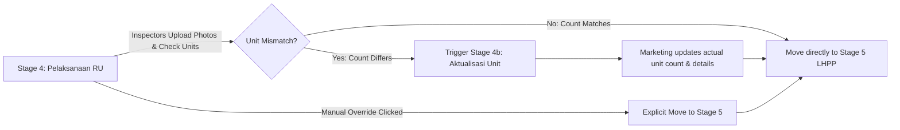
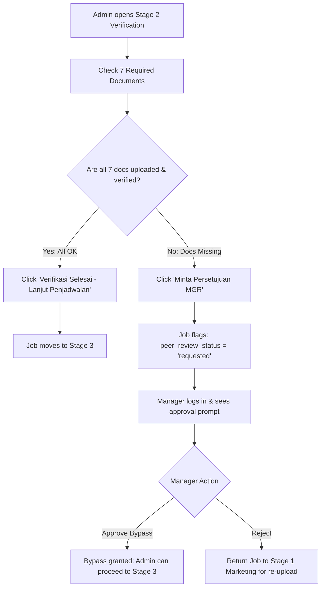
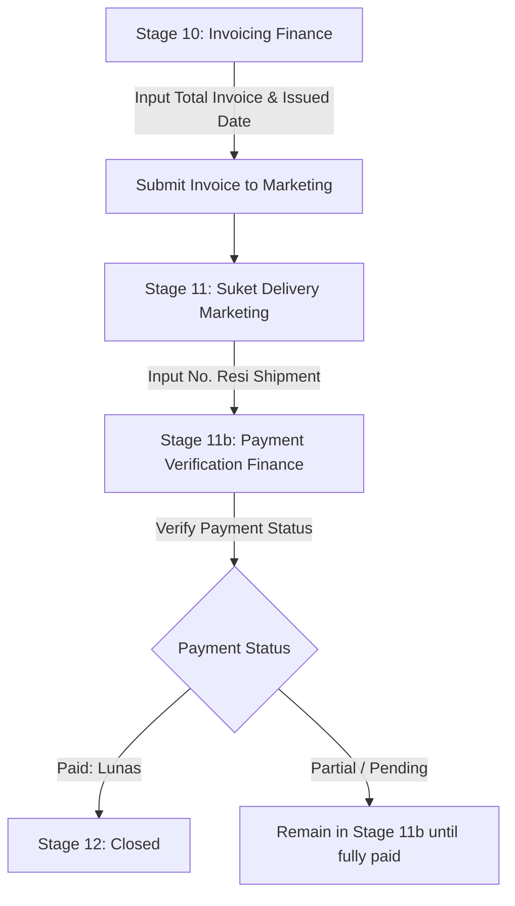

# PT DELTA NUSANTARA PERSADA (DNP MONITOR)
## SYSTEM FLOWCHART & OPERATIONAL USER GUIDELINE MANUAL

---

## 1. Executive Summary & Architecture Overview

**DNP Monitor** is an enterprise-grade workflow automation and project lifecycle management system designed for **PT Delta Nusantara Persada**. It manages the end-to-end RiksaUji (Technical Inspection) pipeline from initial order placement (PO/SPK) through field inspection, technical reporting (LHPP), Disnaker legal verification, invoicing, and Suket delivery.

### Key Technology Stack:
- **Backend**: Laravel 11 (PHP 8.2+)
- **Frontend**: React 18, Inertia.js, Tailwind CSS
- **Database**: MySQL / MariaDB
- **State Engine**: Role-Based Access Control (RBAC) & Stage State Machine

---

## 2. Master Stage Directory & Role Matrix

The system consists of **14 distinct process stages** mapped sequentially across 5 operational departments and Superadmin:

| Stage ID | Display Code | Stage Name | Default Role (PIC) | SLA (Days) | Description & Transition Trigger |
| :---: | :---: | :--- | :---: | :---: | :--- |
| **1** | `1` | PO / SPK | Marketing (`MKT`) | - | Job initiation, client contract, initial unit count & base docs upload. |
| **2** | `2` | Verifikasi Dokumen | Admin (`ADM`) | 1 | 7-point document verification checklist. Requires Manager approval if incomplete. |
| **3** | `3` | Penjadwalan & Surat Tugas | Admin (`ADM`) | 1 | Inspector assignment, Surat Tugas (ST) issuance & H-5 Teman K3 dispatch. |
| **4** | `4` | Pelaksanaan RU | Tim Ahli / Inspektur (`INS`) | - | On-site inspection, mandatory departure/arrival photos, actual unit check. |
| **13** | `4b` | Aktualisasi Unit | Marketing (`MKT`) | 1 | **Conditional Stage**: Triggered when inspectable units mismatch initial PO count. |
| **5** | `5` | Penyusunan LHPP | Tim Ahli / Inspektur (`INS`) | 3 | Draft Technical Report (LHPP), evaluation status entry & findings. |
| **6** | `6` | Review Laporan Teknis | Kadiv RU / Manager (`MGR`) | 1 × Units | Peer review by Kadiv/Manager (Approve / Conditional Approve / Reject). |
| **7** | `7` | Verifikasi ke Dinas | Kadiv RU / Manager (`MGR`) | 1 | Record Disnaker submission date & upload submission proof. |
| **8** | `8` | Process Disnaker | Admin (`ADM`) | 30 | Disnaker tracking (Progress / Stuck / Ready) & return receipt verification. |
| **9** | `9` | Pengurusan Suket | Admin (`ADM`) | 1 | Issuance of Suket, validity period setup, and document upload. |
| **10** | `10` | Penagihan | Admin Keuangan (`FIN`) | 1 | Invoice generation, total invoice amount entry, submit to MKT. |
| **11** | `11` | Pengiriman SUKET ke Klien | Marketing (`MKT`) | - | Suket shipment to client & mandatory **No. Resi** tracking entry. |
| **14** | `11b` | Pembayaran / Pelunasan | Admin Keuangan (`FIN`) | 1 | Payment verification (Paid / Partial / Pending) & financial reconciliation. |
| **12** | `12` | Selesai / Closed | Admin Keuangan (`FIN`) | - | Job archived as fully completed & closed. |

---

## 3. End-to-End System Flowchart

The following Mermaid diagram illustrates the master lifecycle of a Job from creation (Stage 1) to closing (Stage 12).

```mermaid
flowchart TD
    Start([Job Creation by MKT]) --> S1["Stage 1: PO / SPK\n(Marketing)"]
    S1 -->|Submit Docs| S2["Stage 2: Verifikasi Dokumen\n(Admin Dokumen)"]
    
    %% Stage 2 Decision
    S2 --> CheckS2{All Docs OK?}
    CheckS2 -->|Yes| S3["Stage 3: Penjadwalan & ST\n(Admin Dokumen)"]
    CheckS2 -->|Missing / Incomplete| MgrApprove{Request Manager Approval?}
    MgrApprove -->|Approved by MGR| S3
    MgrApprove -->|Rejected| S1
    
    %% Stage 3 to 4
    S3 -->|Assign Inspectors & Issue ST| S4["Stage 4: Pelaksanaan RU\n(Tim Ahli / Inspektur)"]
    
    %% Stage 4 Branching
    S4 --> UnitCheck{Actual Units Match PO Units?}
    UnitCheck -->|Match equal| S5["Stage 5: Penyusunan LHPP\n(Tim Ahli / Inspektur)"]
    UnitCheck -->|Mismatch unequal| S13["Stage 4b: Aktualisasi Unit\n(Marketing)"]
    S13 -->|Update Units & Re-confirm| S5
    
    %% Stage 5 to 6
    S5 -->|Draft LHPP & Evaluations| S6["Stage 6: Review Laporan Teknis\n(Kadiv RU / Manager)"]
    
    %% Stage 6 Decisions
    S6 --> S6Decision{Manager Decision}
    S6Decision -->|Approved / Approved Conditional| S7["Stage 7: Verifikasi ke Dinas\n(Kadiv RU / Manager)"]
    S6Decision -->|Rejected / Revision Needed| S5
    
    %% Stage 7 to 9
    S7 -->|Input Submit Date & Proof| S8["Stage 8: Proses Disnaker\n(Admin Dokumen)"]
    S8 -->|Doc Returned from Disnaker| S9["Stage 9: Pengurusan Suket\n(Admin Dokumen)"]
    
    %% Stage 9 to 12
    S9 -->|Upload Suket & Set Expiry| S10["Stage 10: Penagihan / Invoice\n(Admin Keuangan)"]
    S10 -->|Invoice Issued & Sent| S11["Stage 11: Pengiriman Suket\n(Marketing)"]
    S11 -->|Input No. Resi & Ship| S14["Stage 11b: Pembayaran\n(Admin Keuangan)"]
    S14 --> CheckPaid{Payment Fully Paid?}
    CheckPaid -->|Yes: Paid| S12["Stage 12: Closed / Selesai\n(System Archived)"]
    CheckPaid -->|Partial / Pending| S14
    S12 --> End([Job Lifecycle Complete])

    classDef mkt fill:#e0f2fe,stroke:#0284c7,stroke-width:2px;
    classDef adm fill:#fef3c7,stroke:#d97706,stroke-width:2px;
    classDef ins fill:#dcfce7,stroke:#16a34a,stroke-width:2px;
    classDef mgr fill:#f3e8ff,stroke:#9333ea,stroke-width:2px;
    classDef fin fill:#ffe4e6,stroke:#e11d48,stroke-width:2px;

    class S1,S13,S11 mkt;
    class S2,S3,S8,S9 adm;
    class S4,S5 ins;
    class S6,S7 mgr;
    class S10,S14,S12 fin;
```

---

## 4. Sub-Process Flowcharts

### A. Stage 4 -> Stage 4b (13) Unit Mismatch & Direct Move Logic

### B. Stage 2 Verification & Manager Intercept Flowchart

### C. Stage 10 -> 11 -> 11b (14) -> 12 Invoicing & Suket Delivery Flowchart

---

## 5. General User Guidelines & Navigation

### 1. The Kanban Board (`/kanban`)
- **Columns**: 14 vertical columns representing each active stage.
- **Column Header Badges**: Displays current stage display code (e.g., `1`, `2`, `3`, `4`, `4b`, `5`, `6`, `7`, `8`, `9`, `10`, `11`, `11b`, `12`) and total count of jobs in that stage.
- **Job Cards**: Show Kode Job, Klien name, Equipment/Pesawat, Unit count, Marketing PIC, Tim Riksa Uji badges, and SLA Status Pill.
- **Real-Time Polling**: The Kanban board automatically polls every 10 seconds to keep all concurrent users updated without manual browser refresh.

### 2. SLA Indicators & Color Coding
- 🟩 **ON TRACK** (Green): Time spent in stage is well within the allotted SLA.
- 🟨 **WARNING** (Yellow): Approaching SLA deadline (1 day remaining).
- 🟥 **OVERDUE** (Red): Time spent exceeds SLA limit.
- 🟦 **HARI H / H-X** (Blue/Yellow): Specific to Stage 4 (Inspection Day) relative to today's date.

### 3. Job Detail Sheet (Drawer Component)
Clicking any job card opens the **Job Detail Sheet**, which contains 3 main tabs:
1. **Form Input (Main Action Panel)**: Stage-specific forms, file uploaders, note fields, and progression buttons.
2. **Timeline Status**: Visual progress tracker showing completed stages (✓), current active stage (glowing indicator), and upcoming stages.
3. **Dokumen & History**: Complete repository of uploaded files per stage and full audit log of state changes.

---

## 6. Step-by-Step Standard Operating Procedures (SOPs) by Role

### A. Marketing Department (`MKT`)

#### Task 1: Creating a New Order (Stage 1)
1. Go to **Kanban Board** or **Daftar Job** and click **+ Job Baru**.
2. Fill in initial parameters:
   - **Klien**: Client Company Name.
   - **Pesawat / Jenis Alat**: Select form category (e.g., *Proteksi Kebakaran*, *Lift*, *PAPA*, *Genset*).
   - **Jumlah Unit**: Initial estimated quantity.
   - **Nilai Pekerjaan (Rp)**: PO / SPK total contract value.
   - **Lokasi & Provincial Select**: Select Province & City/District.
3. Upload Stage 1 mandatory documents (PO/SPK File, Proposal/Penawaran).
4. Click **Simpan & Kirim ke Admin Dokumen (Stage 2)**.

#### Task 2: Actualizing Units (Stage 4b / 13)
*Triggered when field inspection discovers unit count differs from Stage 1 PO.*
1. Open the job in Stage **4b (Aktualisasi Unit)**.
2. Review notes submitted by inspector.
3. Adjust **Jumlah Unit Aktual**, input serial numbers, equipment models, or revised pricing if applicable.
4. Click **Konfirmasi Aktualisasi Unit & Lanjut ke Stage 5 (Penyusunan LHPP)**.

#### Task 3: Delivering Suket & Tracking (Stage 11)
1. Open the job in Stage **11 (Pengiriman SUKET ke Klien)**.
2. Prepare physical Suket documents for dispatch.
3. In the input form, enter the mandatory tracking number:
   - **No. Resi**: Enter courier receipt/resi number (e.g., `JNE-9821734912`, `TIKI-88123`, or `Hand-Delivered by PIC`).
4. (Optional) Upload courier receipt photo or client receiving receipt.
5. Click **Suket Terkirim — Lanjut ke Stage 11b Pelunasan**.

---

### B. Admin Dokumen & RU Department (`ADM`)

#### Task 1: Document Verification (Stage 2)
1. Open the job in Stage **2 (Verifikasi Dokumen)**.
2. Review the **7 Mandatory Document Items**:
   - `1. PO / SPK`
   - `2. Surat Permohonan Riksa Uji`
   - `3. Form K3 / Checklist Dokumen`
   - `4. Dokumen Technical Specification`
   - `5. Gambar Layout / Single Line Diagram`
   - `6. Certificate / Suket Lama`
   - `7. Dokumen Pendukung`
3. Mark each item as **✓ OK**, **✕ Tidak**, or **N/A**.
4. If all mandatory docs are **OK**, click **✓ Verifikasi Selesai — Lanjut Penjadwalan →**.
5. If mandatory docs are missing and client requires urgent scheduling, click **Minta Persetujuan MGR** to send an intercept request to the Manager.

#### Task 2: Scheduling & ST Generation (Stage 3)
1. Open the job in Stage **3 (Penjadwalan & Surat Tugas)**.
2. Input **Tanggal Pelaksanaan RiksaUji**.
3. Enter **No. Surat Tugas (ST)**.
4. Assign lead inspector and team members (**Tim Riksa Uji**).
5. Verify **H-5 Teman K3 Disnaker Notification** status.
6. Click **Simpan & Lanjut ke Stage 4 Pelaksanaan RU**.

#### Task 3: Disnaker & Suket Processing (Stage 8 & Stage 9)
1. In Stage **8 (Proses Disnaker)**:
   - Update **Status Disnaker** (`Progress`, `Stuck`, or `Ready`).
   - Enter **Tanggal Dokumen Diterima Kembali**.
   - Click **Lanjut ke Stage 9 Pengurusan Suket**.
2. In Stage **9 (Pengurusan Suket)**:
   - Upload official Disnaker Suket (PDF/Image).
   - Input **No. Suket** and **Masa Berlaku Sampai**.
   - Click **Lanjut ke Stage 10 Penagihan**.

---

### C. Tim Ahli / Inspektur Department (`INS`)

#### Task 1: Executing Field Inspection (Stage 4)
1. Open the assigned job in Stage **4 (Pelaksanaan RU)**.
2. Upload mandatory field proof photos:
   - `Foto Keberangkatan`
   - `Foto Sampai Lokasi Riksauji`
   - `Foto Kepulangan`
3. Enter **Jumlah Unit Aktual Terinspeksi**.
4. If unit count matches Stage 1, click **Selesai Inspeksi — Lanjut ke Stage 5 Penyusunan LHPP**.
5. If unit count mismatches, click **Kirim ke Marketing untuk Aktualisasi Unit (Stage 4b)**.

#### Task 2: Drafting LHPP (Stage 5)
1. Open the job in Stage **5 (Penyusunan LHPP)**.
2. Enter evaluation status for each unit (`LAIK`, `LAIK BERSYARAT`, `TIDAK LAIK`).
3. Enter technical findings and recommendations.
4. Upload LHPP draft document.
5. Click **Submit LHPP ke Manager (Stage 6 Review)**.

---

### D. Kadiv RU / Manager Department (`MGR`)

#### Task 1: Handling Stage 2 Bypass Intercept
1. Check notification bar or Dashboard for **Menunggu persetujuan Kadiv/MGR**.
2. Review missing document reasons provided by Admin.
3. Click **Setujui** to grant document bypass (allowing Admin to schedule Stage 3) OR **Tolak** to return job to Stage 1 Marketing.

#### Task 2: Technical LHPP Review (Stage 6)
1. Open job in Stage **6 (Review Laporan Teknis)**.
2. Review inspector recommendations and findings.
3. Select **Keputusan Review**:
   - `Setujui`: Fully approve technical report.
   - `Setujui Bersyarat`: Approve with conditions noted.
   - `Tolak / Revisi`: Return to inspector for revision.
4. Click **Lanjut ke Stage 7 Penyerahan ke Dinas**.

#### Task 3: Disnaker Submission Recording (Stage 7)
1. Open job in Stage **7 (Verifikasi ke Dinas)**.
2. Input **Tanggal Penyerahan ke Disnaker**.
3. Upload **Bukti Penyerahan ke Disnaker**.
4. Click **Lanjut ke Stage 8 Proses Disnaker**.

---

### E. Admin Keuangan / Finance Department (`FIN`)

#### Task 1: Invoicing (Stage 10)
1. Open job in Stage **10 (Penagihan)**.
2. Enter **Total Invoice (Rp)** and **Tanggal Invoice Diterbitkan**.
3. Select **Status Progress Penagihan**.
4. Click **Kirim Invoice & Lanjut ke Stage 11 (Marketing)**.

#### Task 2: Payment Settlement & Closing (Stage 11b / 14 & Stage 12)
1. Open job in Stage **11b (Pembayaran / Pelunasan)**.
2. Check payment status:
   - `Paid (Lunas Sempurna)`: Full payment received.
   - `Partial`: Partial payment received (remains in Stage 11b).
3. If payment is **Paid**, click **Pelunasan Selesai — Archive & Close Job (Stage 12)**.
4. Job is archived and marked as **Closed / Complete**.

---

### F. Superadmin Role (`SUP`)

Superadmin personnel have global override privileges across all 14 stages:
1. **Global View & Edit**: Can bypass role restrictions to move jobs between any stage.
2. **Database Cleanup**: Access to **Kosongkan Database Job** action in Kanban header for clean testing/seeding resets.
3. **Master Data Management**: Access to `/master-data` for seeding and managing Alat Uji calibration schedules and Inspector profiles.

---

## 7. System Maintenance & Troubleshooting FAQ

### Q1: Why is a job stuck in Stage 4 and won't move to Stage 5?
> **Answer**: Check the unit count entry. If `actual_units` differs from initial PO `units`, click **Kirim ke Stage 4b (Aktualisasi Unit)** so Marketing can re-confirm actual units, or click the explicit **Pindah ke Stage 5** button provided in the Stage 4 action panel.

### Q2: Why does Stage 4b display as `4b` instead of `13`?
> **Answer**: `4b` is the visual display identifier mapped to internal database ID `13`. This ensures the linear Kanban board presents stages logically (`1 -> 2 -> 3 -> 4 -> 4b -> 5...`) rather than showing raw database auto-increment keys.

### Q3: Where do I enter the courier receipt number when Suket is sent?
> **Answer**: In Stage **11 (Pengiriman SUKET ke Klien)** under the **No. Resi** field. This input persists directly into the job record and displays on desktop/mobile job list cards.

---
*Documentation compiled & verified for PT Delta Nusantara Persada (DNP Monitor Rework v2.4).*
