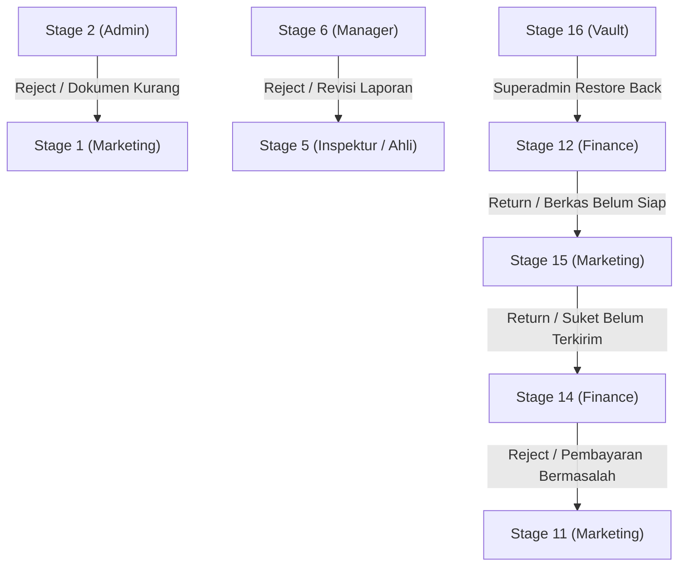

# DNP Monitor — Role-Based Access Control (RBAC) Specification

> **Version:** 2.1 (Production Standard)  
> **Last Updated:** 2026-09-24  
> **Scope:** Full 16-Stage Inspection Pipeline, Document Security, Field Gating, and Special Privileges  
> **Target Branches:** `main` & `main-refactor`

---

## 1. Executive Summary & Principles

The DNP Monitor RBAC architecture enforces strict separation of concerns across operational, technical, financial, and management departments. 

### Core Principles
1. **Single Operational Ownership**: At any given stage, exactly one primary role holds the authority to edit operational fields and execute the transition to the next stage (*Move*).
2. **Strict Financial Masking**: Technical field personnel (`inspektur`, `inspector`, `tim_ahli`) are strictly locked out of viewing commercial pricing, contract values, and PO/SPK documents (`canSeeNilai = false`).
3. **Dual Confirmation on Approvals**: Sensitive transitions (such as Stage 2 bypass, Stage 6 technical approval, and Stage 14 payment verification) require specific role signatures or gate checks before downstream operations can proceed.
4. **Superadmin Sovereign Archival Vault**: Stage 16 (*Selesai*) is a restricted archival vault. Superadmin is the only role that can access the vault and execute urgent job restorations.

---

## 2. Roles & Authority Definitions

| Role Key | Role Title | Department | Primary Responsibility |
| :--- | :--- | :--- | :--- |
| `superadmin` | Super Administrator | Management / IT | Global system configuration, user access management, job reopening, and Stage 16 Archival Vault restore. |
| `admin` | Admin Operasional | Operations | Document verification (S2), inspector scheduling (S3), Disnaker submissions (S7), Disnaker tracking (S8), and Suket reception (S9). |
| `marketing` | Sales & Marketing | Commercial | Job intake & PO upload (S1), billing follow-up (S11), physical Suket delivery (S15), and optional client report handover (S13). |
| `finance` | Finance & Accounting | Finance | Invoice & tax generation (S10), payment verification (S14), and final project document closing (S12). |
| `inspektur` / `inspector` | Lead Inspector | Technical (Field) | On-site technical inspection (S4), measurement data, photo evidence, and drafting technical LHPP reports (S5). |
| `tim_ahli` / `ahli` | Technical Specialist | Technical (Office) | Specialized technical evaluations and LHPP report authorship (S5). |
| `manager` | Kadiv / Manager Operasional | Management | Stage 2 missing-document bypass approval, and final technical review/authorization of LHPP reports (S6). |

---

## 3. Exhaustive 16-Stage Master RBAC Matrix

### Matrix Legend
* **OWNER**: Primary stage operator. Can edit form fields, upload/delete stage documents, and trigger **Move / Advance**.
* **VIEW**: Read-only access (can view cards, timeline, and documents allowed for their role).
* **REJECT**: Can reject / cascade the job back to the previous stage with mandatory audit notes.
* **RESTRICTED**: Strictly blocked from operating or viewing this stage/data.
* **LOCK-PRICE**: Can access technical docs/data, but **Nilai Kontrak / Pricing / PO is completely hidden**.

---

### Detailed Stage Breakdown

| Stage | Stage Name | Owner Role | Superadmin | Marketing | Admin | Inspektur / Ahli | Manager | Finance | Required Gates / Transition Rules |
| :---: | :--- | :---: | :---: | :---: | :---: | :---: | :---: | :---: | :--- |
| **01** | **Order Masuk / PO / SPK** | `marketing` | OWNER | **OWNER** | VIEW | RESTRICTED | VIEW | VIEW | **Gate:** Minimal 1 required doc (`PO/SPK`, `Surat Permohonan`, or `Surat Kuasa`) must be uploaded before moving. |
| **02** | **Verifikasi Dokumen Klien** | `admin` | OWNER | VIEW | **OWNER** | RESTRICTED | **BYPASS** | VIEW | **Gate:** Admin verifies 11 checklist items. Mandatory docs must be OK, or Manager must grant bypass (`peer_review_status = 'approved'`). Can reject to Marketing. |
| **03** | **Penjadwalan & Disnaker** | `admin` | OWNER | VIEW | **OWNER** | VIEW *(if assigned)* | VIEW | VIEW | **Gate:** Must specify Disnaker Tujuan and at least 1 schedule date with assigned inspectors. |
| **04** | **Pelaksanaan Riksa Uji** | `inspektur` | OWNER | VIEW | VIEW | **OWNER**<br>*(LOCK-PRICE)* | VIEW | VIEW | **Gate:** Only assigned inspectors can edit. Must complete inspection checklist, unit validation, and upload field photos/BAP. |
| **05** | **Penyusunan LHPP** | `inspektur` / `tim_ahli` | OWNER | VIEW | VIEW | **OWNER**<br>*(LOCK-PRICE)* | VIEW | VIEW | **Gate:** Must provide multi-unit LHPP Google Drive links or upload draft LHPP file. Assigned inspectors and report writer have access. |
| **06** | **Review & Pengesahan LHPP**| `manager` | OWNER | VIEW | VIEW | VIEW *(LOCK-PRICE)* | **OWNER**<br>& REJECT | VIEW | **Gate:** Manager must approve to advance to Disnaker (S7). Manager can reject back to Stage 5 with specific revision notes. |
| **07** | **Pengajuan ke Disnaker** | `admin` | OWNER | VIEW | **OWNER** | RESTRICTED | VIEW | VIEW | **Gate:** Admin confirms LHPP bundle completeness, submits physical/digital files to Disnaker, and uploads proof of receipt. |
| **08** | **Proses Disnaker** | `admin` | OWNER | VIEW | **OWNER** | RESTRICTED | VIEW | VIEW | **Gate:** Tracks operational Disnaker status (`progress`, `stuck`, `ready`). If `stuck`, `s8_delay_reason` is required. Disnaker follow-up visits logged. |
| **09** | **Penerbitan Suket** | `admin` | OWNER | VIEW | **OWNER** | RESTRICTED | VIEW | VIEW | **Gate:** Admin records Suket numbers and validity dates. Cycles workflow: *Diterima → Scan → Penamaan Cover → Pembuatan Tanda Terima → Selesai*. |
| **10** | **Terbit Invoice & Faktur** | `finance` | OWNER | VIEW | VIEW | RESTRICTED | VIEW | **OWNER** | **Gate:** Must fill Nomor Invoice, Total Nilai Tagihan (> 0), Tanggal Terbit, Faktur Pajak, and upload Invoice PDF. |
| **11** | **Follow-up Penagihan** | `marketing` | OWNER | **OWNER** | VIEW | RESTRICTED | VIEW | VIEW | **Gate:** Marketing records payment reminders, billing communication, and collection notes. |
| **14** | **Verifikasi Bayar (11b)** | `finance` | OWNER | VIEW | VIEW | RESTRICTED | VIEW | **OWNER**<br>& REJECT | **HARD GATE:** Advance to Stage 15 is **strictly blocked** until Finance sets payment status to **"Lunas"** and uploads Bukti Transfer / Kwitansi. |
| **15** | **Pengiriman Suket (11c)** | `marketing` | OWNER | **OWNER** | VIEW | RESTRICTED | VIEW | VIEW | **Gate:** Marketing records physical resi / tanda terima. Advance to Stage 12 allowed only if payment was verified Lunas. |
| **12** | **Closing Dokumen** | `finance` | OWNER | VIEW | VIEW | RESTRICTED | VIEW | **OWNER** | **Gate:** Finance compiles final project file and accounting recap. Clicking "Selesai" archives job to Stage 16. |
| **13** | **Penyerahan Laporan (Ops)**| `marketing` | OWNER | **OWNER** | VIEW | RESTRICTED | VIEW | VIEW | Optional branch workflow for direct physical handover of reports to client office. |
| **16** | **Arsip Selesai (Vault)** | `superadmin` | **OWNER**<br>*(EXCLUSIVE)* | RESTRICTED | RESTRICTED | RESTRICTED | RESTRICTED | RESTRICTED | **SUPERADMIN SPECIAL PRIVILEGE:** Hidden from standard Kanban board. Superadmin only can view, audit, and **Restore Back** to active Kanban. |

---

## 4. Sensitive Data Masking & Privacy Rules

### 4.1. Commercial Pricing Protection (`canSeeNilai`)
Commercial pricing (Nilai Kontrak, Total Invoice, Nilai Tagihan, PPN 12%, and PO financial terms) is strictly classified.

* **Formula**:
  ```javascript
  const isINS = user?.role === 'inspektur' || user?.role === 'inspector';
  const canSeeNilai = !isINS;
  ```
* **Enforcement Points**:
  - `JobDetailSheet.jsx`: If `isINS` is true, Nilai Kontrak in header, Stage 1 summary, and Stage 10 billing cards render as `Rp ••••••••` (masked) or are completely omitted.
  - Kanban Cards: Nilai badges are hidden when logged in as an inspector.

### 4.2. Document Locking for Inspectors (`isPoLockedForIns`)
* Inspectors are barred from downloading or opening client PO/SPK documents to prevent exposure of client rates and terms.
* Document pills for `PO/SPK` display as: `🔒 Terkunci (Privat)` for inspectors.

---

## 5. Reverse Transitions & Rejection Rules

When work is rejected or returned for corrections, the system strictly enforces the following return paths:



* **Mandatory History Tracking**: Every rejection records `returned_from_stage` and `notes` in `job_history`.

---

## 6. Code Enforcement Pointers

If you need to adjust permissions, modify the following code locations:

### 1. Stage Buckets
* **Frontend**: `resources/js/Constants.js`
  ```javascript
  export const MKT_STAGES = [1, 11, 13, 15];
  export const FIN_STAGES = [10, 12, 14];
  ```
* **Backend**: `app/Http/Controllers/JobController.php`
  ```php
  private const MKT_STAGES = [1, 11, 13, 15];
  private const FIN_STAGES = [10, 12, 14];
  ```

### 2. User Model Default Fallbacks
* **File**: `app/Models/User.php` (`canOwnStage` method)
  Governs whether a user has fallback authority if custom dynamic stage permissions are empty.

### 3. Dynamic Database Overrides
* **Table**: `stage_permissions`
  - Columns: `role_id`, `role_name`, `stage`, `can_view`, `can_edit`, `is_owner`.
  - Governed by: `2026_09_23_000001_seed_stage15_permissions_and_workflow_updates.php` and `2026_09_24_000001_add_stage16_selesai_permissions.php`.

### 4. Stage 16 Superadmin Exclusivity
* **File**: `resources/js/Components/JobDetailSheet.jsx`
  ```javascript
  if (curStage === 16 && user?.role !== 'superadmin') return false;
  ```
* **File**: `resources/js/Pages/Kanban/Index.jsx`
  The `Arsip Selesai` toggle and Stage 16 column are only rendered if `user?.role === 'superadmin'`.
