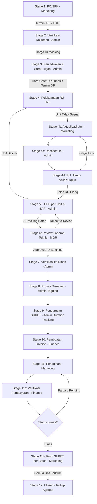

# DNP Monitor v3 Revision Implementation Plan

> **For agentic workers:** REQUIRED SUB-SKILL: Use `superpowers:subagent-driven-development` (recommended) or `superpowers:executing-plans` to implement this plan task-by-task. Steps use checkbox (`- [ ]`) syntax for tracking.

**Goal:** Transform DNP Monitor into Version 3 (v3) based on the complete requirements in `Laporan_Revisi_Sistem_DNP_Monitor_tahap_1_Rev6.md`, upgrading from monolithic job-level stage progression to granular Unit-level tracking, multi-batch SUKET delivery, repositioned Stage 11c Payment Verification with retry loops, strict role-based price masking, and automated escalation reminders.

**Architecture:** A domain-driven Laravel 11 + Inertia.js + React architecture decoupling the aggregate `Job` into `Unit` (Alat), `InspectionEvent` (with `BAP`), `LHPP` (per Unit, versioned), `Batch` (for Disnaker & SUKET delivery), and `PaymentVerification` (repositioned between Stage 11 and Gateway). Job status and stage completion are derived via automated database aggregations (rollups) rather than manual binary gates.

**Tech Stack:** PHP 8.2+ / Laravel 11, Inertia.js v1/v2, React 19, Tailwind CSS, Pest PHP / PHPUnit, MySQL / SQLite, Vite.

---

## Global Constraints

- **TDD Workflow:** Plan → Test (Red) → Implement (Green) → Review → Verify → Remember → Improve. Never write production code before failing tests exist.
- **Branch Discipline:** All work takes place on the `v3` branch; `dnp-rework` remains untouched.
- **Price Masking (Hard Gate):** Admin must NEVER receive price data (`nilai`) in API payloads or Inertia props. Price is exclusively accessible to Marketing, Finance, and Manager.
- **Infinite Ceiling SLA:** Jobs with stuck units in Stage 4b–4c–4d remain `Partial` indefinitely without auto-cancellation, governed by multi-tier escalation reminders (Day 7: Warning, Day 14: Manager Escalation, Recurring every 14 days).
- **Payment Verification Repositioning (Rev. 6):** Stage 11c is strictly placed **between Stage 11 (Penagihan) and Gateway "Status Lunas?"**. A status of `Partial` or `Pending` from Finance loops back to Stage 11 for Marketing re-billing, incrementing `retry_count`.
- **Granular Cardinality:**
  - 1 Job → N Units
  - 1 InspectionEvent → N Units (M:N via `inspection_units`)
  - 1 InspectionEvent → 1 BAP
  - 1 Unit → N LHPPs (1 active `is_final = true`)
  - 1 Job → N Batches
  - 1 Batch → N Units (M:N via `batch_units`, where `lhpp.status = 'Approved'`)

---

## User Review Required

> [!IMPORTANT]
> **Stage 11c Repositioning & Gateway Loopback:**
> Rev. 6 repositions Stage 11c (Verifikasi Pembayaran) to immediately follow Stage 11 (Penagihan). If Finance marks payment as `Partial` or `Pending`, the Job automatically loops back to Stage 11 for Marketing to re-bill. SUKET release (Stage 11b) remains strictly locked until Finance confirms `Lunas`.

> [!WARNING]
> **Database Schema Migration Strategy:**
> Introducing `units`, `batches`, `lhpps`, `baps`, and `payment_verifications` replaces the legacy single-row status tracking. A backward-compatible data backfill migration will automatically convert existing `dnp_jobs` (using `units` count and `pesawat` string) into corresponding `dnp_units` records so no historical jobs are corrupted.

---

## Open Questions & Clarifications

1. **Invoice Granularity (Section 8.4):** The plan defaults to 1 Invoice per Job (termin DP or Full) in Stage 10. Does Finance require split invoices per Batch in Phase 1, or should that remain a Phase 2 consideration? *(Assumed 1 Invoice per Job as per section 8.4).*
2. **Escalation Thresholds (Section 8.6):** Default SLA reminder thresholds are set to 7 days (Reminder 1: Marketing & Admin) and 14 days (Reminder 2: Manager). These are configured as editable environment/database settings.

---

## Proposed Changes & Phased Execution

Grouped strictly according to the installed workflow command set:
**Plan → Test → Implement → Review → Verify → Remember → Improve**

---

### Phase 1: Plan & Tooling (Step 1 & Step 2 — Completed)

- [x] Branch `v3` created off current working state and verified matching `dnp-rework` commit history.
- [x] 17 custom slash commands installed under `.claude/commands/`:
  - Plan: `/plan`, `/architect`, `/api-design`, `/db-schema`
  - Test: `/test`
  - Implement: `/implement`, `/backend`, `/frontend`, `/devops`
  - Review: `/review`, `/security`, `/performance`
  - Verify: `/verify`
  - Remember: `/document`, `/remember`
  - Improve: `/refactor`, `/improve`

---

### Phase 2: Test Suite Design (TDD Red Phase — `/test`)

Before any implementation, the following automated test classes will be created in `dnp-rework/tests/Feature/` and `dnp-rework/tests/Unit/`:

#### [NEW] [JobV3DataModelTest.php](file:///d:/Download%20Backup/Lovable/dnp-monitor/dnp-rework/tests/Feature/JobV3DataModelTest.php)
- Test unit creation, cascade relations, and aggregate calculations (`job_status`, `closed_unit_count`).
- Test `InspectionEvent` linking multiple units and generating a single `BAP`.
- Test `LHPP` versioning per unit and final flag constraint.
- Test `Batch` grouping with requirement that `lhpp.status == 'Approved'`.

#### [NEW] [JobV3SecurityAndMaskingTest.php](file:///d:/Download%20Backup/Lovable/dnp-monitor/dnp-rework/tests/Feature/JobV3SecurityAndMaskingTest.php)
- Test that Admin requests to Job API / Inertia props do NOT contain `nilai` or commercial figures.
- Test that Marketing, Manager, and Finance can view `nilai`.
- Test that non-authorized roles cannot update sensitive stages.

#### [NEW] [JobV3StageProgressionTest.php](file:///d:/Download%20Backup/Lovable/dnp-monitor/dnp-rework/tests/Feature/JobV3StageProgressionTest.php)
- Test Stage 1: `termin_pembayaran` validation (`DP` vs `FULL`).
- Test Stage 3: Surat Tugas blocked if `termin_pembayaran == 'DP'` and DP is unpaid.
- Test Stage 4: Split flow — Unit A (`Sesuai`) advances to Stage 5; Unit B (`Tidak Sesuai`) diverted to Stage 4b.
- Test Stage 5: LHPP three tracking dates (`tanggal_data_teknis_diserahkan`, `tanggal_mulai_pengerjaan`, `tanggal_selesai`).
- Test Stage 6: Manager Review approve vs reject-to-revise loop.
- Test Stage 7-9: Admin PIC for Stage 7, Status tagging in Stage 8, and SUKET duration calculation in Stage 9.
- Test Stage 11c & Gateway: Repositioned 11c payment verification. If `Partial` or `Pending`, verify redirection/loopback to Stage 11 and increment of `retry_count`.
- Test Stage 11b & 12: Stage 11b unlocks only on `Lunas`. Job advances to Stage 12 Closed only when 100% of units are delivered and verified.

---

### Phase 3: Implementation Tasks (`/implement`, `/backend`, `/frontend`)

#### Task 1: Database Schema & Core Eloquent Models (`/db-schema`, `/backend`)
**Files:**
- Create: `dnp-rework/database/migrations/2026_09_07_000001_create_dnp_v3_core_schema.php`
- Create: `dnp-rework/app/Models/Unit.php`
- Create: `dnp-rework/app/Models/InspectionEvent.php`
- Create: `dnp-rework/app/Models/BAP.php`
- Create: `dnp-rework/app/Models/LHPP.php`
- Create: `dnp-rework/app/Models/Batch.php`
- Create: `dnp-rework/app/Models/PaymentVerification.php`
- Modify: `dnp-rework/app/Models/Job.php`

**Details:**
1. Create table `dnp_units`: `id`, `job_id`, `nama_alat`, `no_seri`, `kategori`, `ru_result`, `current_stage`, `unit_status`, `final_lhpp_id`, `batch_id`, `closed_at`.
2. Create table `inspection_events`: `id`, `job_id`, `type`, `tanggal_pelaksanaan`, `petugas_ahli_id`.
3. Create join table `inspection_units`: `inspection_id`, `unit_id`, `hasil_unit`.
4. Create table `dnp_baps`: `id`, `inspection_id`, `file_url`, `ditandatangani_oleh`, `tanggal_terbit`.
5. Create table `dnp_lhpps`: `id`, `unit_id`, `source_inspection_id`, `version_number`, `is_final`, `status`, `tanggal_data_teknis_diserahkan`, `tanggal_mulai_pengerjaan`, `tanggal_selesai`, `reviewer_manager_id`, `decision`.
6. Create table `dnp_batches`: `id`, `job_id`, `batch_sequence`, `current_stage`, `status_tag`, `tanggal_verifikasi_dinas`, `tanggal_input_suket`, `tanggal_terbit_suket`, `durasi_proses_suket`, `tanggal_kirim`, `status_kirim`, `no_resi`.
7. Create join table `batch_units`: `batch_id`, `unit_id`.
8. Create table `payment_verifications`: `id`, `job_id`, `verified_by`, `verified_at`, `bukti_url`, `status`, `retry_count`.
9. Alter `dnp_jobs`: Add `termin_pembayaran` (`DP`, `FULL`), `dp_paid` (boolean), `total_unit_count`, `reschedule_reason_log` (json).
10. Implement computed attributes on `Job`: `getJobStatusAttribute()`, `getClosedUnitCountAttribute()`.
11. Write backfill script for existing jobs to populate `dnp_units`.

#### Task 2: RBAC Policy & Price Masking Hard-Gate (`/security`, `/backend`)
**Files:**
- Create: `dnp-rework/app/Policies/JobPolicy.php`
- Modify: `dnp-rework/app/Http/Controllers/JobController.php`
- Modify: `dnp-rework/app/Http/Resources/JobResource.php` (or Job serialization)

**Details:**
1. Update `JobPolicy` and Inertia controller payload builder: If `auth()->user()->role === 'admin'`, strip `nilai` from the returned job model and all related queries.
2. Ensure Stage 2 document verification accepts "Sertifikat Bahan" upload (specifically for PAA, escalator, elevator).

#### Task 3: Stage 1 & Stage 3 Enhancements (`/backend`, `/frontend`)
**Files:**
- Modify: `dnp-rework/app/Http/Controllers/JobController.php`
- Modify: `dnp-rework/resources/js/Pages/Jobs/Create.jsx`
- Modify: `dnp-rework/resources/js/Components/JobDetailSheet.jsx`

**Details:**
1. Stage 1: Add mandatory `termin_pembayaran` dropdown (`DP` / `FULL`). No seri mandatory only if `kategori` is `Listrik` or `Kebakaran`.
2. Stage 3: Implement Reschedule button with mandatory reason modal logging to `reschedule_reason_log`.
3. Stage 3 Hard-Gate: Prevent Surat Tugas generation/advancement if `termin_pembayaran === 'DP'` and `dp_paid === false`.

#### Task 4: Stage 4 Unit-Level Inspection & Split Flow (`/backend`, `/frontend`)
**Files:**
- Create: `dnp-rework/app/Services/InspectionService.php`
- Modify: `dnp-rework/app/Http/Controllers/JobController.php`
- Modify: `dnp-rework/resources/js/Components/JobDetailSheet.jsx`
- Create: `dnp-rework/resources/js/Components/UnitInspectionManager.jsx`

**Details:**
1. Inspector marks RU result per individual unit (`Sesuai` / `Tidak Sesuai`).
2. Sesuai units advance immediately to Stage 5 (`current_stage = 5`).
3. Tidak Sesuai units branch into `Stage 4b` (`current_stage = '4b'`).
4. Inspection event generates a single BAP covering all units inspected in that session.

#### Task 5: Stage 4b–4d Rework Chain & Escalation Reminder Service (`/backend`)
**Files:**
- Create: `dnp-rework/app/Services/EscalationReminderService.php`
- Create: `dnp-rework/app/Console/Commands/CheckUnitEscalations.php`
- Modify: `dnp-rework/app/Http/Controllers/JobController.php`

**Details:**
1. Stage 4b: Marketing reviews unit rework and initiates reschedule (`current_stage = '4c'`).
2. Stage 4c: Admin reschedules inspection (`current_stage = '4d'`).
3. Stage 4d: Ahli / Petugas performs re-test. If passed, unit advances to Stage 5 with new versioned LHPP.
4. Console command checks units stuck in 4b/4c/4d:
   - > 7 days: Notify Marketing & Admin, tag yellow badge.
   - > 14 days: Notify Manager, tag red badge.
   - Recurring every 14 days: Repeat Manager notification.

#### Task 6: Stage 5 LHPP per-Unit & Stage 6 Review Manager (`/backend`, `/frontend`)
**Files:**
- Modify: `dnp-rework/app/Http/Controllers/JobController.php`
- Create: `dnp-rework/app/Services/LHPPService.php`
- Modify: `dnp-rework/resources/js/Components/JobDetailSheet.jsx`
- Modify: `dnp-rework/resources/js/Pages/Kanban/Index.jsx`

**Details:**
1. Admin records three tracking dates per LHPP:
   - `tanggal_data_teknis_diserahkan`
   - `tanggal_mulai_pengerjaan`
   - `tanggal_selesai`
2. Display LHPP sub-phase lead times and tracking dates on Kanban cards and Job sheet.
3. Decision gateway: Standard bypass to Manager queue vs direct review.
4. Stage 6: Manager can Approve or Reject-to-Revise. Reject sends LHPP back to Admin in Stage 5.

#### Task 7: Stage 7–9 Batch Management & SUKET Tracking (`/backend`, `/frontend`)
**Files:**
- Create: `dnp-rework/app/Http/Controllers/BatchController.php`
- Modify: `dnp-rework/app/Http/Controllers/JobController.php`
- Create: `dnp-rework/resources/js/Components/BatchManagerModal.jsx`
- Modify: `dnp-rework/resources/js/Components/JobDetailSheet.jsx`

**Details:**
1. Admin forms Batches from units with `Approved` LHPP.
2. Stage 7: Verifikasi ke Dinas assigned 100% to Admin swimlane.
3. Stage 8: Admin tags Disnaker status per Batch: `On Track`, `Delayed`, `Issue` (surfaced on Marketing dashboard).
4. Stage 9: Admin inputs `tanggal_input_suket` and `tanggal_terbit_suket` per Batch. System calculates `durasi_proses_suket` (`terbit - input`).

#### Task 8: Stage 10–11c Financial Workflow & Gateway Loopback (`/backend`, `/frontend`)
**Files:**
- Modify: `dnp-rework/app/Http/Controllers/JobController.php`
- Create: `dnp-rework/app/Http/Controllers/PaymentVerificationController.php`
- Modify: `dnp-rework/resources/js/Components/JobDetailSheet.jsx`

**Details:**
1. Stage 10: Finance generates Invoice (DP or Full).
2. Stage 11: Marketing performs collection / payment follow-up.
3. Stage 11c: Finance verifies payment proof (`verified_by`, `verified_at`, `bukti_url`, `status`).
4. Gateway "Status Lunas?":
   - If `status === 'Verified'` (Lunas) → Unlocks Stage 11b (Kirim SUKET).
   - If `status === 'Partial'` or `'Pending'` → Loops Job back to Stage 11, increments `retry_count`, and displays retry alert on Marketing & Finance dashboards.

#### Task 9: Stage 11b Batch SUKET Delivery & Stage 12 Closed Aggregation (`/backend`, `/frontend`)
**Files:**
- Modify: `dnp-rework/app/Http/Controllers/BatchController.php`
- Modify: `dnp-rework/app/Http/Controllers/JobController.php`
- Modify: `dnp-rework/resources/js/Components/JobDetailSheet.jsx`
- Modify: `dnp-rework/resources/js/Pages/Jobs/List.jsx`

**Details:**
1. Marketing records batch delivery: `tanggal_kirim`, `status_kirim = 'Terkirim'`, `no_resi`.
2. Stage 12: Job automatically rolls up to `Closed` when 100% of Units are `Closed` and payment is verified.
3. If partial units remain in rework loop, Job displays `Partial (e.g. 95/100 Unit Closed)`.

#### Task 10: Frontend UI Polish & Kanban Integration (`/frontend`, `/improve`)
**Files:**
- Modify: `dnp-rework/resources/js/Pages/Kanban/Index.jsx`
- Modify: `dnp-rework/resources/js/Components/JobDetailSheet.jsx`
- Modify: `dnp-rework/resources/js/Pages/Dashboard/Index.jsx`

**Details:**
1. Enhance Kanban board cards:
   - Add Unit progress bar (e.g. `95/100 Lolos RU`).
   - Add Disnaker status badge (`On Track`, `Delayed`, `Issue`).
   - Add Stage 5 LHPP tracking date tooltips.
   - Add Escalation alert badges (Yellow for >7d, Red for >14d).
   - Add Payment retry counter badge (`Retry Penagihan: 2x`).
2. Cleanly modularize `JobDetailSheet.jsx` so each stage panel is a maintainable sub-component.

---

### Phase 4: Review (`/review`, `/security`, `/performance`)

- [ ] **Security Audit (`/security`):**
  - Verify RBAC policies across all 12 stages.
  - Verify price masking for Admin across all JSON endpoints and Inertia page props.
  - Verify file upload validation for BAP, LHPP, SUKET, and Payment Proof.
- [ ] **Performance Profiling (`/performance`):**
  - Verify eager loading of `units`, `batches`, `lhpps` on Kanban and Job list queries.
  - Verify indexes on `dnp_units`, `dnp_batches`, `dnp_lhpps`.
  - Check rollup calculation efficiency using SQL aggregate subqueries.
- [ ] **Code Architecture Review (`/review`):**
  - Verify SOLID principles, DRY/YAGNI, and single-responsibility decomposition.

---

### Phase 5: Verification & QA (`/verify`)

- [ ] Run full automated test suite: `php artisan test`.
- [ ] Run frontend build: `npm run build` to verify asset compilation with zero errors.
- [ ] Verify test database migrations: `php artisan migrate:fresh --seed`.
- [ ] Conduct manual browser verification for:
  1. Job creation with Termin DP vs Full.
  2. Admin price masking.
  3. Surat Tugas hard-gate blocking.
  4. Unit RU result split (partial units advancing vs diverted to 4b).
  5. LHPP 3-date tracking and manager review.
  6. Batch formation and SUKET duration calculation.
  7. Stage 11c payment verification loopback and retry counter.
  8. Partial batch SUKET delivery and aggregate Job Closed rollup.
- [ ] Document all results in `walkthrough.md`.

---

### Phase 6: Document & Remember (`/document`, `/remember`)

- [ ] Update `REWORK_MASTER_DOCUMENTATION.md` and user guides to reflect v3 changes.
- [ ] Persist learnings and architectural rules regarding infinite ceiling escalations and multi-batch tracking.

---

### Phase 7: Refactor & Continuous Improvement (`/refactor`, `/improve`)

- [ ] Refactor oversized components in `resources/js/Components/` to ensure long-term maintainability.
- [ ] Optimize Kanban filtering and search responsiveness.
